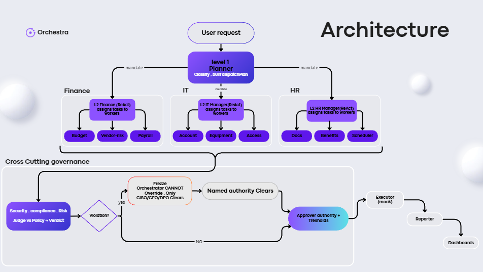

<div align="center">


### Dynamic Adaptive Enterprise Orchestrator

*A meta-orchestrator that assembles specialized AI agent teams on the fly, enforces policy-as-code governance, and keeps humans in the loop — with full traceability.*

<sub>**by the team AOT**</sub>

---

</div>

## Overview

Orchestra turns a plain-language enterprise request — *"onboard a contractor"*, *"approve a $95k purchase"*, *"validate this invoice"* — into a fully orchestrated, governed workflow. A **Planner** agent decomposes the request, dynamically assembles a team of department agents, executes the work, and routes the result through a **deterministic, un-bypassable governance gate**. Risky actions are frozen until a named human authority (CISO / CFO / DPO) clears them. Every step is streamed live and persisted as an audit trail.

## Architecture

<div align="center">



</div>


The engine is a real **LangGraph `StateGraph`** with conditional routing and shared typed state. A vetoed run routes **only** to the frozen terminal — there is no graph edge from a freeze to execution.

## How It Works

| Stage | What happens |
|---|---|
| **1 · Planner** | Recalls similar past cases from memory, then an LLM produces a structured `DispatchPlan`: domain, extracted fields, which departments + workers to run, and its reasoning. The team is assembled **per request** — not a fixed pipeline. |
| **2 · Departments** | Each department manager runs its specialist workers. One generic agent node runs any worker from its `AgentSpec` in `rule` (deterministic), `single` (one LLM call), or `react` (reason→tool→observe loop) mode. |
| **3 · Governance** | Two **deterministic** overseers evaluate hard rules and spend ceilings. Decisions are code + numbers (auditable, defensible) — never an LLM. A violation raises a `Veto`. |
| **4a · Frozen** | If vetoed, the run freezes and alerts the owning department's admin. Only the named authority can clear it. |
| **4b · Reporter** | If clean, it compiles the final report and flags any threshold-based human approvals. |

### Governance rules (examples)

| Rule | Condition | Cleared by |
|---|---|---|
| `SEC-04` | Contractor requesting production access | **CISO** |
| `PROC-07` | Vendor processes personal data, no DPA on file | **DPO** |
| `FIN-12` | Spend exceeds the $1,000,000 hard ceiling | **CFO** |
| `DZ-INV-01` | Invoice missing mandatory legal fields (NIF / fiscal stamp) | **DPO** |

> Governance is **deterministic and un-bypassable**. An LLM may *explain* a freeze, but it never *decides* one. The freeze can only be lifted by the specific authority the rule names — verified server-side and logged.

## Key Design Principles

- **Dynamic, not scripted** — the Planner decides the agent team for each request.
- **Policy-as-data** — all company policy lives in JSON (`agents-orch/data/`). A different company ships a different file → different behavior, **zero code change**.
- **Human-in-the-loop with accountability** — only the right authority can clear a freeze; the resolution is recorded.
- **Institutional memory** — every run is remembered; precedents inform future planning; veto resolutions teach the system.
- **Full traceability** — every step is a `StepEvent`, streamed live over WebSocket **and** persisted as an audit log. Any past run's graph is reconstructable.
- **Local-first LLM** — Ollama runs on-prem by default, so sensitive data never leaves your infrastructure (Claude / Gemini also pluggable).

## Tech Stack

| Layer | Technology |
|---|---|
| Engine | Python · LangGraph (StateGraph, conditional routing, shared state) |
| Contracts | Pydantic (validated LLM output, frontend contract, audit schema) |
| LLM | Pluggable factory — Ollama (local default), Claude, Gemini |
| Gateway | FastAPI — REST + WebSocket |
| Persistence | SQLModel |
| Auth | Keycloak — OIDC, 8 realm roles, department-scoped JWTs, RBAC per route |
| Frontend | Next.js dashboard (separate repo / `AOT`) |

## Repository Layout

```
backend-AOT/
├── agents-orch/              # the orchestration engine
│   ├── graph.py              # LangGraph StateGraph (nodes, routing)
│   ├── schemas.py            # all Pydantic contracts
│   ├── llm.py                # LLM factory (Ollama / Claude / Gemini)
│   ├── memory.py             # institutional memory + feedback loop
│   ├── sentinel.py           # proactive risk scan
│   ├── agents/
│   │   ├── planner.py        # dynamic team assembly
│   │   ├── manager.py        # department coordination
│   │   ├── configurable.py   # one generic worker node (rule/single/react)
│   │   └── governance.py     # deterministic overseers + veto logic
│   ├── tools/                # leaf tools (mocked external-system calls)
│   └── data/                 # company config, policies, org data (policy-as-data)
│
└── gateway/                  # FastAPI gateway
    ├── app/
    │   ├── main.py           # app wiring, CORS, route registration
    │   ├── core/
    │   │   ├── auth.py        # Keycloak JWT verification + RBAC
    │   │   ├── events.py      # WebSocket event bus
    │   │   └── config.py      # env-driven settings
    │   ├── routes/           # runs, admin, logs, llm, registry, settings
    │   └── services/         # run execution, Keycloak admin
    └── keycloak/             # realm import + docker-compose
```

## Getting Started

### 1 · Install dependencies

```bash
pip install -r requirements.txt
```

### 2 · Start Keycloak (auth)

```bash
docker compose -f gateway/keycloak/docker-compose.yml up
```

Imports the `orchestrai` realm: 8 roles, the dashboard OIDC client, a `department` token claim, and demo users. Admin console at `http://localhost:8080` (`admin` / `admin`).

### 3 · Run the gateway

```bash
cd gateway

# Dev mode (role/department via headers — build the frontend without Keycloak)
python run.py

# Production mode (full Keycloak JWT verification)
export DEV_AUTH=0
export KEYCLOAK_JWKS_URL=http://localhost:8080/realms/orchestrai/protocol/openid-connect/certs
export KEYCLOAK_ISSUER=http://localhost:8080/realms/orchestrai
python run.py
```

Gateway runs at `http://localhost:8000` (`/health` to check).

### 4 · (Optional) Local LLM

```bash
ollama pull llama3.1:8b      # default planner + worker model
```

Set the active model from the dashboard (**LLM Config**) or via `OLLAMA_BASE_URL` / `PLANNER_MODEL` / `WORKER_MODEL`.

## Demo Users

| Username | Password | Role | Can clear |
|---|---|---|---|
| `admin1` | `admin1` | company_admin | everything |
| `hr1` | `hr1` | hr_admin | — |
| `it1` | `it1` | it_admin | — |
| `finance1` | `finance1` | finance_admin | — |
| `ciso` | `ciso` | ciso · it_admin | security freezes (SEC-04) |
| `cfo` | `cfo` | cfo · finance_admin | spend freezes (FIN-12) |
| `dpo` | `dpo` | dpo | data-privacy freezes (PROC-07, DZ-INV-01) |

## What's Real vs Mocked

- **Real:** the LangGraph orchestration, Planner + worker LLM reasoning, deterministic governance, the un-bypassable freeze branch, RBAC, institutional memory + feedback loop, full audit persistence.
- **Mocked:** only the **leaf tools** (e.g. `grant_access`, `credit_check`, `order_equipment`) — the external-system calls. Everything orchestrating them is real.

---

<div align="center">
<sub>Built by the team <b>AOT</b> · Orchestra — enterprise AI orchestration with policy-as-code and full traceability.</sub>
</div>
